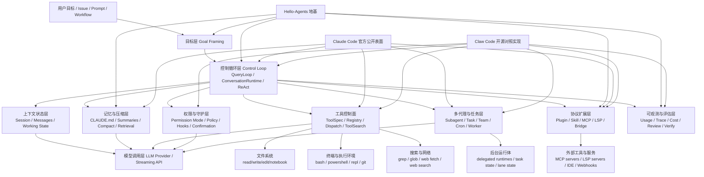

# Claude Code 风格智能体实现地图：从地基、官方表面到开源对照实现

## 1. 为什么要先画“实现地图”

研究 Claude Code 这类 coding agent，如果只按功能菜单看，很容易得到一堆碎片：

- 有 bash
- 有 read/write file
- 有 sub-agent
- 有 hooks
- 有 MCP
- 有 plan mode

但这些“有”并不能自动告诉我们系统是怎么工作的。

更稳的方法，是先画一张 **Claude Code 风格智能体实现地图**，把系统拆成几层：

1. **地基层**：智能体的通用定义与控制范式
2. **官方表面层**：Claude Code 当前公开可证的产品面与接口面
3. **对照实现层**：像 `claw-code` 这种开源 harness 展示出来的运行时骨架
4. **环境执行层**：文件系统、终端、网络、代码库、外部服务

这样再看具体产品，就不会把菜单、提示词、运行时和协议层混成一团。

---

## 2. 总图：Claude Code 风格智能体实现地图

这张图的关键意思是：

- **Claude Code 风格系统的中心不是模型，而是控制循环**
- **工具、权限、记忆、任务、协议** 都是围绕这个控制循环组织起来的
- 真正落地能力的最后一跳，永远是**环境动作**

---

## 3. 地基层：Hello-Agents 告诉我们应该先看什么

`BB-2026-05-01-326` 给了这张地图的理论骨架。

### 3.1 智能体不是聊天框，而是闭环

最小定义是：

- 感知环境
- 维护内部状态
- 基于目标做决策
- 通过执行器改变环境

映射到 coding agent：

- 环境 = 代码库、终端、网络、配置、Issue/PR
- 感知 = 读文件、grep、日志、测试输出、web fetch
- 决策 = 下一步该搜、改、跑、问、压缩还是交给子代理
- 执行 = 写文件、跑命令、切计划模式、创建任务、调用外部协议

### 3.2 控制循环是第一骨架

`hello-agents` 里最适合映射 Claude Code 的三种范式是：

- **ReAct**：边看边做
- **Plan-and-Solve**：先拆再做
- **Reflection**：失败后修正

这直接决定了我们地图中央为什么必须是 **Control Loop**。

### 3.3 记忆、上下文、协议、评估是四块独立层

很多人会把它们都塞进“Prompt 工程”。但地基材料明确提醒我们：

- 记忆不是纯 prompt，而是状态外化
- 上下文不是“多喂点字”，而是装配与压缩工程
- 协议不是工具附庸，而是多系统协作边界
- 评估不是上线后再说，而是运行质量的一部分

所以它们在实现地图里都应该是独立节点。

---

## 4. 官方表面层：Claude Code 当前公开可证的部分落在哪

`BB-2026-05-01-325` 的核心结论是：**Claude Code 当前公开可证的是“表面层很厚”，但核心 runtime 并未完整开源。**

### 4.1 官方当前公开的，主要是这些层

从公开 repo、docs、npm wrapper 能比较稳地看到：

- 插件系统
- commands / agents / skills / hooks
- MCP server 接入面
- task / cron / monitor / worktree / REPL 等工具面
- `sdk-tools.d.ts` 反映出来的宿主能力接口

把它映射到地图里，主要落在：

- **控制循环外缘的工具控制面**
- **多代理与任务层**
- **协议扩展层**
- **上下文/记忆的外化工件层**

### 4.2 官方当前不完全可见的，是中间核心 runtime 细节

因为当前 npm 采用的是：

- wrapper + native binary

所以这些部分更难直接看到完整源码：

- query loop 细节
- tool orchestration 内部逻辑
- permission runtime 细节
- session compaction 细节
- worker / subagent 的完整内部实现

也就是说，Claude Code 官方公开层更像是把“地图边缘的接口面”露出来了，但“地图中间的 engine room”没有完整公开。

---

## 5. 对照实现层：Claw Code 把中间骨架展示成可读代码

这就是 `BB-2026-05-01-327` 的价值。

`claw-code` 不是官方源码，但它把 Claude Code 风格系统的中间层，转化成了**可以直接读的 Rust 结构**。

### 5.1 control loop 在 `ConversationRuntime`

它明确把主循环落在：

- `ConversationRuntime`
- `run_turn()`
- `AssistantEvent`
- `TurnSummary`

这让“用户输入 → 模型流 → tool_use → tool_result → 下一轮”这条线变得具体可见。

### 5.2 工具控制面在 `tools` crate

它把：

- `ToolSpec`
- `mvp_tool_specs()`
- `execute_tool_with_enforcer()`

独立成统一工具平面。

这比从产品 UI 猜工具能力，要清楚得多。

### 5.3 权限门是独立 enforcement layer

通过 `PermissionEnforcer`，我们能看到一个非常典型的 coding-agent 结构：

- tool 不直接自说自话地决定风险
- risk classification 是单独控制面
- 不同 mode 会直接切断不同动作

这说明权限不是附属品，而是运行时骨架。

### 5.4 sub-agent 不是 prompt 技巧，而是后台 runtime

`Agent` 工具不是“套娃发请求”，而是：

- 落 manifest
- 起独立线程
- 限制 allowed tools
- 构建独立 `ConversationRuntime`
- 持久化完成态或失败态

这让地图里的 **多代理与任务层** 不再只是概念。

### 5.5 task / team / cron / MCP / LSP 体现了扩展控制面

这些能力说明一个成熟 coding agent 不会只停留在：

- 文件读写
- bash
- 搜索

而会继续长出：

- 任务底座
- 多 lane / team 协作
- 协议桥接
- 编辑器语义能力

这就是 Claude Code 风格智能体和普通 code assistant 的根本差异之一。

---

## 6. 分层解释：这张地图每一层分别负责什么

下面按实现顺序解释。

### 6.1 目标层：系统要先把“任务”变成可执行目标

输入不只是自然语言 prompt，还可能是：

- issue
- PR review 请求
- slash command
- workflow 触发
- delegated subtask

这层的作用，是把模糊目标变成 agent runtime 能继续处理的任务对象。

### 6.2 控制循环层：系统的大脑节拍器

这是整张图最中心的部分。

它负责：

- 调模型
- 接收流式输出
- 识别 tool_use
- 执行工具
- 回灌结果
- 决定是否继续下一轮
- 决定是否 compact / stop / escalate / delegate

没有这层，就没有智能体，只剩一次性生成。

### 6.3 上下文状态层：让每一轮不是失忆重来

这层通常包含：

- 当前 session messages
- 当前 turn state
- 当前模型设置
- 当前 workspace / branch / mode
- 任务中间状态

这是运行时“工作记忆”。

### 6.4 记忆与压缩层：把长任务做下去

这层解决两个问题：

1. 上下文窗口有限
2. 任务会跨轮、跨会话、跨子代理

典型工件包括：

- `CLAUDE.md`
- compact summary
- session memory
- retrieval
- task packet / handoff artifact

### 6.5 工具控制面：把环境动作收束成可调度接口

工具层不是简单“会调很多函数”，而是要有：

- tool schema
- tool name
- tool dispatch
- tool search
- result normalization
- sometimes output truncation / artifact externalization

它解决的是：**模型如何稳定地触达环境能力**。

### 6.6 权限与守护层：把风险变成结构化门禁

这层回答的是：

- 这个动作需要什么权限模式？
- 用户是否要确认？
- 路径是否越界？
- bash 是否是读操作还是写操作？
- hook 是否要拦截 / 注入 / 审计？

如果没有这层，coding agent 很快会从“能干活”变成“不可控”。

### 6.7 多代理与任务层：让 agent 能拆任务而不是死撑单线程

这层包括：

- sub-agent spawning
- task registry
- team / worker / lane
- cron / remote trigger
- task status / heartbeat / output

它负责把“大任务”切成能被不同运行体处理的工作单元。

### 6.8 协议扩展层：让 agent 不困死在内置工具箱

这一层包括：

- plugin
- skill
- MCP
- LSP
- IDE bridge
- webhook / remote trigger

它解决的是：**系统怎么继续长能力，而不是每加一个能力就把核心 runtime 改烂。**

### 6.9 可观测与评估层：让系统可调、可审、可回归

这层通常包括：

- token/cost usage
- trace / telemetry
- hook events
- review / verify
- failure reason
- retry / compaction / recovery evidence

没有这层，就算系统“偶尔很强”，也很难稳定演进。

---

## 7. Claude Code 风格实现里，哪些是“核心骨架”，哪些是“扩展件”

这张地图还有一个很重要的用途：**判断优先级**。

### 7.1 核心骨架

缺了就很难称为 Claude Code 风格 agent：

- 控制循环
- session/context 状态
- 工具注册与调度
- 权限门
- 长上下文压缩/记忆外化
- 至少一种子任务/任务管理机制

### 7.2 高价值扩展件

不是最小必需，但会显著提高系统上限：

- sub-agent role allowlist
- structured output
- plan mode runtime override
- MCP bridge
- LSP semantic tooling
- plugin/skill marketplace
- task/team/cron

### 7.3 表面交互件

这些很重要，但本质上是“壳的外观”，不是骨架本身：

- REPL UI
- slash commands
- IDE dialogs
- pretty rendering
- onboarding / doctor / status pages

这个区分很重要，因为很多人在复刻系统时会优先做外观，结果核心循环和权限层非常薄。

---

## 8. 如果你要自己复刻，推荐按这张地图的顺序实现

一个比较稳的实现顺序是：

1. **最小控制循环**
   - 用户输入
   - 模型调用
   - tool_use
   - tool_result

2. **最小工具面**
   - read / grep / glob / write / bash

3. **权限门**
   - read-only / workspace-write / full access

4. **session + compact**
   - 保证长任务不炸

5. **task / subagent**
   - 让任务能拆

6. **skill / plugin / MCP**
   - 让能力能扩

7. **trace / usage / verify**
   - 让系统可治理

这也是为什么我们在专题里需要同时保留：

- 地基材料 `BB-2026-05-01-326`
- 官方公开分析 `BB-2026-05-01-325`
- 开源对照实现 `BB-2026-05-01-327`

三者拼起来，顺序就完整了。

---

## 9. 一句话总括这张地图

**Claude Code 风格智能体，不是“模型 + 一堆工具”，而是“以控制循环为核心、以工具契约和权限门为支点、以记忆/任务/协议层为延展、最终作用于真实工程环境的 agent harness”。**
